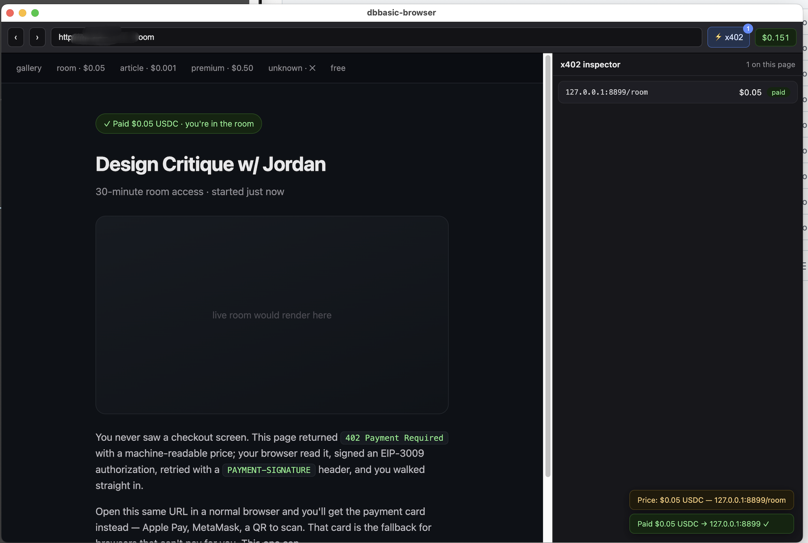

# dbbasic-browser

A browser with first-class [x402](https://x402.org) support — pay for web resources
in stablecoins, transparently, at machine speed. Point it at a page that returns
`402 Payment Required` and it reads the price, pays, and shows you the content. No
popup, no API key, no subscription.



*Same URL that shows a checkout card in a normal browser opens straight into the paid
content here. The **⚡x402 inspector** (right) shows the payment that just happened —
challenge, decision, signed authorization, receipt — while the toolbar tracks your
wallet balance and spend. (Local demo gallery.)*

> **Status: early, but it moves real money.** The engine, proxy, and Electron shell
> work and are tested. The browser signs real EIP-3009 authorizations and **settles them
> on-chain through a live facilitator on Base Sepolia** — see the
> [`/live` route](#real-on-chain-settlement-base-sepolia) and a
> [confirmed transaction](https://sepolia.basescan.org/tx/0x13c171c0a11d9d23c98318cf8a07cb5fec0fe4fd956a3bd6790e50267c594e50).
> It is **testnet-only and unaudited** — do not point it at mainnet with real funds. See
> [Status](#status).

---

## Why this is a browser, not an extension

x402 needs one specific thing from a browser: when a request returns `402`, something
must inspect the challenge, perform an **async** signature, re-issue the request with a
payment header, and hand the second response back to the page as if it were the first.

A Manifest V3 extension **cannot do this.** MV3 removed blocking `webRequest`, and its
replacement is declarative — it can't pause a subresource, await a signature, and
resume. Transparent payment for arbitrary subresources requires owning the network
stack. A browser (via Electron's `protocol.handle`) or a local proxy can; an extension
can't. That's the whole reason this project exists as a browser.

## The design principle: don't trust the server you're paying

The interesting engineering here isn't the payment handshake (that's ~200 lines). It's
that **the resource server is not trusted** to describe its own payment. A naive x402
client takes three things straight from the 402 response and signs against them:

1. **The EIP-712 domain** (`name`/`version`) it signs over — so the party being paid
   chooses what your wallet attests to.
2. **The asset**, an arbitrary token address — so without pinned decimals a client
   can't actually tell whether `amount: 100000000` is ten cents or a hundred dollars.
3. **The authorization lifetime** (`maxTimeoutSeconds`) — so a server can request a
   year-long window, bank your signed authorization, and settle it whenever it likes.

dbbasic-browser refuses all three:

- A **pinned asset registry** ([`assets.ts`](packages/engine/src/assets.ts)) is the
  root of trust. The EIP-712 domain and decimals come from our table, never the
  server's `extra`. An asset we can't price is an asset we won't pay.
- The authorization lifetime is **clamped** (default 120s), regardless of what the
  server asks.
- Because EIP-3009 is signature-based, exposure equals exactly what you sign — so the
  **signing policy is the security boundary**. Budgets are scoped to
  *(the page you're looking at × the origin being paid)* and rate-limited, not just
  amount-limited. A hostile page firing 1,000 sub-cent 402s hits the rate cap, not your
  balance. Every one of these is covered by a test.

## Monorepo layout

```
packages/engine/   @dbbasic/x402-engine   the payment engine — no UI, no Electron
packages/proxy/    @dbbasic/x402-proxy     a local proxy: any browser/agent, port 8402
apps/browser/      @dbbasic/browser        the Electron browser
```

The engine depends on nothing but `fetch`. The proxy and the browser are thin adapters
over it, so the payment path a human's browser takes is byte-for-byte the one an agent
or a curl-through-the-proxy takes — and all of it is testable headlessly.

## Quickstart

Requires Node 20+.

```bash
npm install          # installs all workspaces
npm test             # runs the engine, proxy, and browser test suites
```

**See it pay, in a real browser window:**

```bash
# terminal 1 — a local x402 example gallery
node apps/browser/demo/x402-demo-server.mjs

# terminal 2 — build and launch the browser (opens on the gallery)
npm run build   -w @dbbasic/browser
npm start       -w @dbbasic/browser
```

The browser opens on a **gallery** of x402-gated pages, each designed to trigger a
different payer decision. Click through them and watch the toolbar and the **⚡x402
inspector**:

| Page | Price | dbbasic-browser does |
|------|-------|----------------------|
| Live payment | $0.001 | **settles for real on Base Sepolia** — merchant balance rises, refundable |
| Room / article | $0.05 / $0.001 | auto-pays (mock settlement) |
| Tip jar | you pick | variable — small auto-pays, larger ones prompt |
| Metered API | $0.002 | a JSON endpoint — an agent pays it identically to the browser |
| Two ways to pay | $0.10 / $0.04 | prices both, pays the **cheaper** one |
| Premium report | $0.50 | **asks first** (over the auto-approve threshold) |
| Unknown token | — | **refuses** (asset not in the pinned registry) |
| Free page | — | loads normally, pays nothing |

Everything but `/live` uses mock settlement, so clicking around is free. Now open the
**same gallery in a normal browser** — it can't pay, so every page renders its human
fallback body (a checkout card with Apple Pay, a wallet, a QR). One browser shows
payment cards; the other shows the content. That contrast is the entire pitch — and
because each page exercises a distinct code path, the gallery doubles as a functional
test rig for the payer.

### Real on-chain settlement (Base Sepolia)

The browser is **wallet-aware**: the toolbar shows your USDC balance read live over RPC,
a **Fund** button opens the faucet with your address copied, and the **`/live`** route
settles a real $0.001 payment through the [x402.org facilitator](https://x402.org/facilitator).
Watch your balance drop and the merchant's rise, then hit **Refund** to send it back —
so testnet funds circulate instead of draining (the facilitator pays the gas).

To try it: generate a fresh testnet key, fund the address with USDC from
[faucet.circle.com](https://faucet.circle.com) (Base Sepolia), and set `X402_PRIVATE_KEY`
and `X402_MERCHANT_KEY` in `.env` (see [`.env.example`](.env.example)). A gated live test
proves settlement independently:

```bash
RUN_LIVE_SETTLE=1 npx vitest run live-settlement   # from packages/engine — moves $0.001
```

**Or use the proxy with any browser or agent:**

```bash
npm start -w @dbbasic/x402-proxy      # listens on 127.0.0.1:8402
curl -x http://127.0.0.1:8402 http://127.0.0.1:8899/
```

## Status

Works and is tested: the engine, the proxy (HTTP + HTTPS via a local MITM CA), and the
Electron shell (`protocol.handle` interception, native approval dialog that shows the
price before signing, live spend meter, per-tab payment inspector). The browser signs
real EIP-3009 authorizations and settles them **on-chain on Base Sepolia** via a live
facilitator, with a working buyer→merchant→refund loop.

Not done yet:

- **The wallet is a local key.** It reads `X402_PRIVATE_KEY` from `.env` (gitignored,
  `chmod 600`). Moving it into the OS keychain, isolated from any real funds, is the
  next hardening step.
- **Testnet only, and unaudited.** Real settlement is proven on Base Sepolia; nothing
  here has been security-reviewed, and it must not touch mainnet funds yet.
- **EVM only.** Solana (`exact` SVM) is not implemented.
- **USDC price is hardcoded at $1.** Fine for USDC, wrong for EURC or anything
  non-pegged — needs a real FX source.
- **The seller side is minimal.** The demo server settles via the facilitator for the
  `/live` route; a general resource-server/"seller" library lives elsewhere.

## Security

This software terminates TLS (in the proxy) and signs payment authorizations. Read
[SECURITY.md](SECURITY.md) before running it against anything real.

## License

See [LICENSE](LICENSE).
